
<h1 align=center  style="text-align:center;" ><b>１.可行性分析</b><b><o:p></o:p></b></h1><h2><b>１</b><b>.１</b><b>游戏行业前景</b><b><o:p></o:p></b></h2>
１.１.1.大趋势<o:p></o:p>

现在国内游戏发展十分好，一是玩家越来越多；二是肯付费的玩家越来越多。<o:p></o:p>

１.１2.游戏发展历程<o:p></o:p>

游戏产业是一个新兴的朝阳产业，经历了20世纪末的初期形成期阶段，以及21世纪初的快速发展，现在中国游戏产业处在成长期并快速走向成熟期的阶段。&#160;&#160;<o:p></o:p>

我国游戏产业呈现快速稳定的良好发展态势，不仅形成日渐完善的产业链和相对成熟的产业发展环境，而且本土原创游戏在实现由量变到质变跨越同时，积极拓展海外市场。各类游戏在游戏品种、数量、题材类型、市场规模和从业人员数量等方面，都实现了持续快速的增长。由单一大型多人在线到网页游戏、社区游戏、手机网游等新品种不断的涌现，由以魔幻类游戏题材为主到益智、军事等游戏投放市场。<o:p></o:p>
<h2><b>１</b><b>.２</b><b>开发游戏的原因</b><b><o:p></o:p></b></h2>
1.２.１国内独立游戏发芽<o:p></o:p>

独立游戏领域越来越受重视，技术的进步使得开发游戏的门槛越来越低；我们运用掌握的知识再补充一些游戏行业的知识就可以进行游戏开发。<o:p></o:p>

１.2.２学而致用<o:p></o:p>

团队的三名成员都喜欢玩游戏，想要把所学的知识运用到自己喜欢的领域；投身于自己喜欢的领域并且在这个领域有所发展是我们每个人的梦想。我们都对游戏充满兴趣所以在开发的过程中都是主动且积极的。<o:p></o:p>

<![if !supportLists]>１.<![endif]>２3.游戏的变现能力<o:p></o:p>

回顾我们所做过的购物网站等等课程设计，都只是简单的套用所学的知识来完成一个网站，并没有上线运行以及投入使用和盈利。在这样一个全民创业的时代，我们希望我们完成的产品能够投入使用，给我们带来金钱或其他回报。游戏比其他产品更注重代入感和互动，通过全方位的调动用户的感官，很容易让用户体验到自我意识，一旦用户认同了游戏中的身份，他们就很容易在游戏里花钱。<o:p></o:p>
<h2><b>１</b><b>.３</b><b>技术可行性</b><b><o:p></o:p></b></h2>
１.３.１Unity3D介绍<o:p></o:p>

Unity3D是由Unity&nbsp;Technologies开发的一个游戏引擎，操作界面如下图所示，它集快速性交互性于一体，带有强大的渲染引擎，对DirectX、OpenGL拥有高度优化的图形渲染管道，能够允许开发者能够高效直观的开发出2D或者3D游戏，是一个全面整合的游戏引擎。并且，Unity3D游戏引擎能够十分方便的将开发出&nbsp;的游戏发布到各个平台，如iPhone、Android等&nbsp;平台。此外，还可以用Unity&nbsp;Web&nbsp;Player插件将作品发布成网页游戏，玩&nbsp;家只需下载这个很小的插件就能轻轻松松的玩Unity网页版游戏。Unity3D游戏引擎通过使用植被系统Unitree，提供了大量的Shader供开发者使用，这些Shader完全足以满足开发者的需求，使得即使在低端硬件设备下也&nbsp;能&nbsp;够运行广阔茂盛的植被景观。打开地形编辑器，从左到右依次是：地形拉&nbsp;升降低、准确的绘制地形高度、地形圆滑、地形文理绘制、地形植被绘制树木、地形植被绘制-草及小物体、地形参数设置。另外，它支持所有主要&nbsp;的文件格式，并能和其他应用程序协同工作。它还用了PhysX的物理引擎，使得开发者能够轻松的实现各种物理效果。Unity游戏引擎提供了柔和阴影与烘焙的高度完善的光影渲染系统，它的着色器整合了易用性、灵活性和高性能的特点。目前，Unity3D游戏引擎最新版本是Unity4.0，它能将你的作品发布到MAC、Windows、安卓等十个以上当今盛行的平台。此外，购买功能更加强大的正版Unity3D游戏引擎，经授权之后可以安装在2个不同的系统，如一个Windows，一个Mac，官方网址是unity3d.com。Unity3D游戏引擎研讨会正在茁壮发展。第一次Unity3D游戏引擎研讨&nbsp;会是在2010年5月，举办地点是在韩国，引发了许许多多的商家投资并签订了引擎预定协议。亚洲作为Unity3D游戏引擎公司的一个重要战略地，2013&nbsp;年在上海举办了研讨会。不久Unity3D游戏引擎公司又宣布取消支持对Flash的支持。<o:p></o:p>

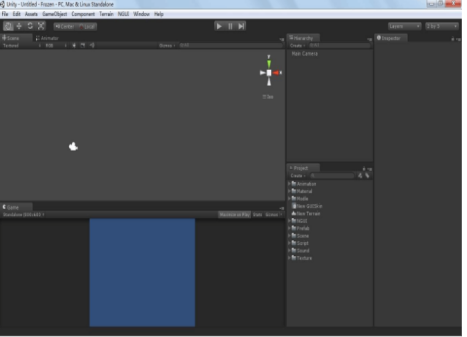<o:p>&nbsp;</o:p>

Unity3D操作界面<o:p></o:p>

１.３.２Unity3D语言开发环境及开发工具&nbsp;&nbsp;<o:p></o:p>

Unity3D是一款综合型的游戏开发引擎。其中MonoBehaviour是该公司&nbsp;自己开发的一个编译工具，自然跟Unity3D是十分兼容的，比如调试等就十分方便。当然，也可以选择自己的编译工具，如Visual&nbsp;Studio&nbsp;2010，只需要在菜单里面设置一下默认编译工具就行，这样在你创建并打开代码文档时就默认打开了你所设置的编译工具。目前，Unity3D只允许3种编程语言：C#、&nbsp;javascript、Mobo。其中C#运用较为广泛，因为它的兼容性比较好，便于更好的发布到各个平台。<o:p></o:p>

1.3&nbsp;.３Unity3D应用<o:p></o:p>

目前，用Unity3D游戏设计引擎开发手机游戏的比较多，如勇者之心、&nbsp;神庙逃亡系列、愤怒的小鸟等；也有用来开发单机游戏的，如轩辕剑六、捣蛋猪等；网页游戏诸如新仙剑Online、QQ乐团等，部分游戏截图如下图所示。在虚拟现实方面，只需要将在Maya或者Max等其他三维软件里面做出的模型导出为fbx格式，然后导入Unity3D，设置摄像机代&nbsp;码、UI、Build。<o:p></o:p>

1.３.4&nbsp;Unity3D未来优势&nbsp;<o:p></o:p>

很多游戏引擎起初都是很不起眼的，Unity在2004年诞生于丹麦，后来&nbsp;把总部设在了美国旧金山。到2014年，其注册人数已达80万，仅是苹果应用商店里面用Unity开发的游戏已达一千五百多个。在未来，随着Web、IOS、Android等平台越来越广泛的应用，因它强悍的跨平台能力和易学的功能界，Unity3D游戏设计引擎必将变大炙手可热。&nbsp;&nbsp;Unity3D是开发者使用最广的游戏引擎，目前有53.1%的开发所开发的游戏是通过Unity3D游戏引擎来开发制作的，其中在一项调查中显示，开发选择这款引擎一个最重要的因素是它的开发周期短。之所以这样，是因为他们都觉得Unity3D游戏引擎简单易学，功能强大；有一定程序基础的人只需要一两个月就能入门。<o:p></o:p>

１.３.５&nbsp;Unity3D优势<o:p></o:p>

１）跨平台的先进技术&nbsp;<o:p></o:p>

Unity3D开发的游戏和应用主要使用的是C#语言、javascript、Mobo，其编译的过程根据目标平台的变化而不尽相同。在PC、Mac和Android平台上，你所写的代码会被系统编译成字节码，并且可以在Runtime用JIT(Just&nbsp;In&nbsp;Time的缩写，中文意思是即时编译器)编译器执行。如果是在其他的平台上，那么游戏在执行是代码是需要进行一个预编译的，转变成目标机器的本地代码而执行。&nbsp;&nbsp;&nbsp;这就是为什么Unity3D开发的游戏能够支持多平台，能够发布到近十几种十分流行的平台上去。<o:p></o:p>

2）轻松入门&nbsp;<o:p></o:p>

目前为止，注册Unity3D用户已达八十多万，每天在线人数达二十多万，如果在学习使用Unity3D的时候可以随时上官网论坛上去请求帮助。更重要的一点是你所遇到的问题，其实在之前很多人都遇到过，这样你的问题就很快能得到解决。另外，Unity3D的交互性特点可以让你即使程序基础不是很好也能设计出你想要的游戏。<o:p></o:p>

３）市场影响力广<o:p></o:p>

现在不管是哪行哪业，什么产品，都将就一个客户需求量，也就是市场，那么Unity3D的市场怎么样呢？&nbsp;&nbsp;同诸多游戏引擎不同的是，Unity3D不仅仅处在3D游戏市场，也能够制作完美的2D游戏，Unity3D支持很多平台（Windows、IOS、Mac等十余种），还支持许多游戏机（PS3、Wii等），以及浏览器等等，市场范围是如此之广。在一项调查中显示，一个开发者在开发一个3D游戏的时候，有72%的人首选的开发工具是Unity3D。他们往往还选择用Unity3D做一下视觉结构、军事仿真等等。<o:p></o:p>

１.３.６游戏前景&nbsp;<o:p></o:p>

如今游戏正在蓬勃发展，属于一种朝阳行业，而且本游戏的设计背景又源自于一部风靡全球的作品，当用户看见这个名字时会不经意的去下载它。就客户量来说，随着这部电影的喜爱着的增加，加上用户量庞大，因此本游戏具有它的客户量。就经济效益来说，游戏开发的时间和成本都很低，需要的资源很很少，却能带来很多的经济效益。&nbsp;就市场来说，由于Unity3D可以把产品发布到十多个目前流行的平台，它的市场面是十分广大的。<o:p></o:p>

 <o:p></o:p>
<h1 align=center  style="text-align:center;" ><b>２.开发过程</b><b><o:p></o:p></b></h1><h2><b>２.１设计探讨阶段</b><b><o:p></o:p></b></h2>
首先我们先探讨要做一个什么游戏，即这款游戏的核心要素是什么。游戏开发游戏是一门需要多方配合的工程，需要美工，程序，策划，测试来整体配合。最后，基于时间的考虑和技术上的可实现性，决定制作一款音乐反应类的３Ｄ游戏。<o:p></o:p>

１）场景搭建<o:p></o:p>

因为团队没有美工基础，所以从网上下了低级模型，自行搭建场景。<o:p></o:p>

首先下载好之后，导入资源包效果如下。<o:p></o:p>

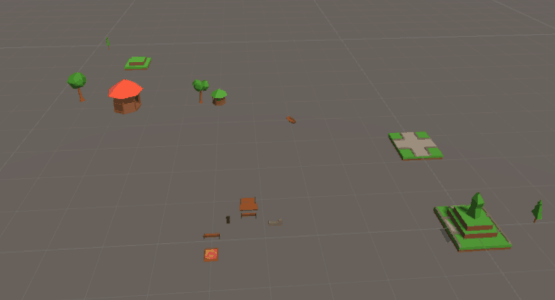<o:p>&nbsp;</o:p>

通过零碎资源搭建起零碎场景。<o:p></o:p>

自行搭建场景，在场景搭建，调试过程中存在问题：<o:p></o:p>

<table cellpadding="0"  cellspacing="0" ><tr><td width="21"  height="0" ></td></tr><tr><td></td><td>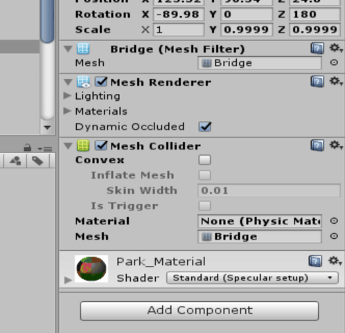</td></tr></table>首先因为初次使用，在Untiy3D搭建环境中，大量使用敏感度高的Mesh&nbsp;Collider。<o:p></o:p>

在Unity&nbsp;Profiler工具下，发现场景资源渲染占用内存较大，鉴于游戏要跨平台发布，出于对游戏性能考虑，逐一对场景组件的Collider进行分析，对于桥，水池等较精细，具有一定的垂直高度的物体对象，仍保留内存损耗较大的Mesh&nbsp;Collider，对于地面，树木等进行Collider更换，把Mesh&nbsp;Collider改为Box&nbsp;Collider。<o:p></o:p>

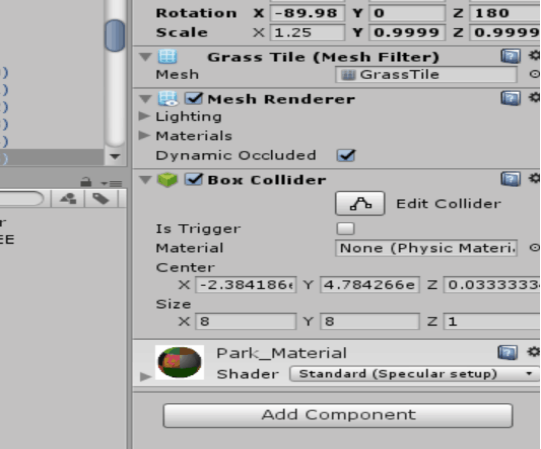<o:p>&nbsp;</o:p>

<o:p>&nbsp;</o:p>

修改后性能损耗如下<o:p></o:p>

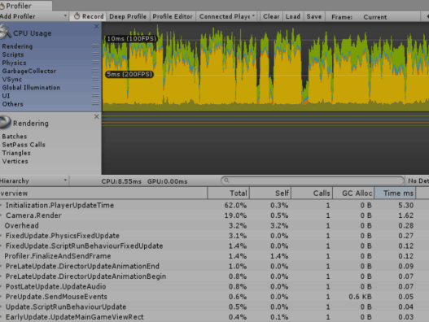<o:p>&nbsp;</o:p>

最后搭建好的游戏场景如下<o:p></o:p>

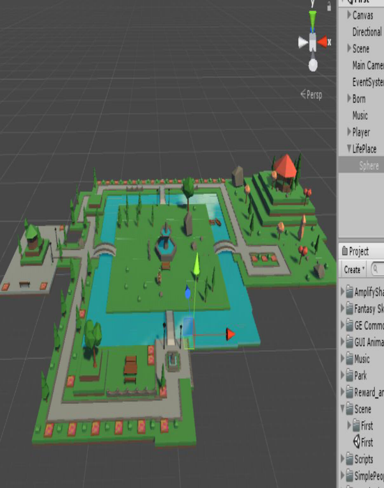<o:p>&nbsp;</o:p>

<o:p>&nbsp;</o:p>

<o:p>&nbsp;</o:p>

<b>２）对象骨架的绑定</b><b><o:p></o:p></b>

对象模型下载好后，发现无法在物体运动过程中进行人为形态变化操作。查询资料后发现，该对象模型的骨骼系统不符合标准的人形骨骼系统，为了实现人<table cellpadding="0"  cellspacing="0" ><tr><td width="-0.933333"  height="0" ></td></tr><tr><td></td><td>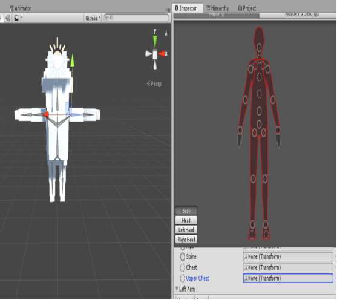</td></tr></table>物对象动画效果，必须重新绑定好人物骨骼。绑定前，对象模型的骨骼系统报错，如图<o:p></o:p>

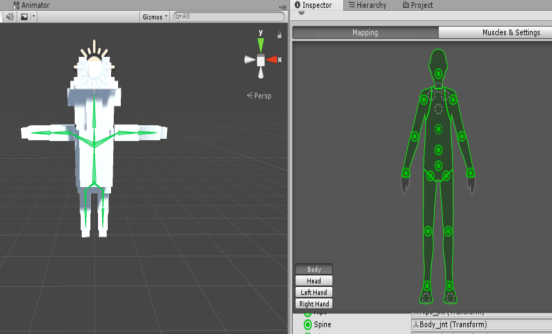重新绑定后，对象模型的骨骼系统完成，可以流畅运行预期的动画效果。<o:p></o:p>

<o:p>&nbsp;</o:p>

<o:p>&nbsp;</o:p>

<o:p>&nbsp;</o:p>

<o:p>&nbsp;</o:p>

<o:p>&nbsp;</o:p>

<o:p>&nbsp;</o:p>

<o:p>&nbsp;</o:p>

但是在人物运行过程中，发现人物对象不具有真正的物理形态。人物对象出现无法与周围对象发生交互，不符合现实人物行为表现。查阅资源后，发现根本原因在于人物对象没有添加Rigidbody，在Untiy引擎中，不受力影响的物体不能发生实际的物理交互效果，即会出现起跳后，人物滞空不下垂等情况。<o:p></o:p>

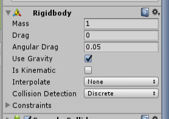<o:p>&nbsp;</o:p>

<b>３）添加天空盒特效</b><b><o:p></o:p></b>

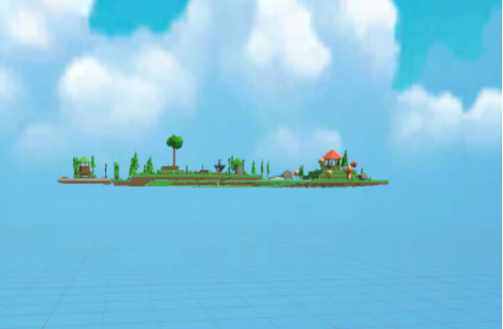<o:p>&nbsp;</o:p>

<o:p>&nbsp;</o:p>

<b>４）添加音效组件</b><b><o:p></o:p></b>

<o:p>&nbsp;</o:p>

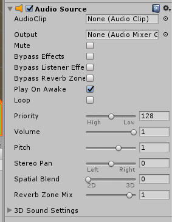<o:p>&nbsp;</o:p>

<b>５）添加声音的监听者</b><b><o:p></o:p></b>

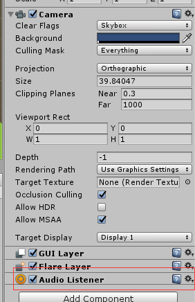<o:p>&nbsp;</o:p>
<h1 align=center  style="text-align:center;" ><b>３.逻辑设计阶段</b><b><o:p></o:p></b></h1>
我们在如何构建游戏的实现上，主要采取以下３种模式：<o:p></o:p>
<h2><b>３.１观察者模式：</b><b><o:p></o:p></b></h2>
在游戏开发设计中，游戏场景是按帧执行的。为了优化游戏性能，一般要减少帧的使用。所以响应式代码往往比每帧执行的Ｕｐｄａｔｅ（）等方法性能更优。而且观察者模式可以解除耦合，让耦合的双方都依赖于抽象，从而使得各自的变换都不会影响另一边的变换。例如在场景中：<o:p></o:p>

（１）在时间监听中，时间为消息的发布者，玩家和安全区为消息的接收者。当只剩１０秒的时候，安全区接受到消息实例化。当时间为０时，玩家接收到消息，判断是否死亡。<o:p></o:p>

（２）在音乐监听中，音乐为消息的发布者，玩家为消息的接收者。当音乐变化到特定的频段时，玩家接受消息，判断自身的状态是否应该死亡。<o:p></o:p>

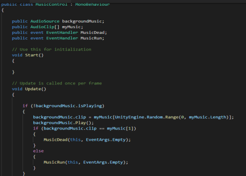<o:p>&nbsp;</o:p>

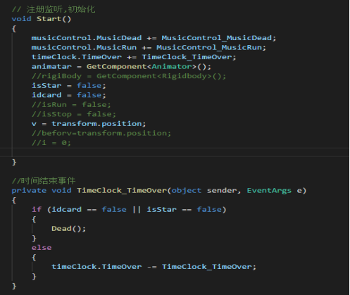<o:p>&nbsp;</o:p>
<h2><b>３.２状态机</b><b><o:p></o:p></b></h2>
利用状态机方便修改人物的状态，可以减少很多判断语句的书写，例如在动画播放的过程，可以根据人物的状态来确定播放的效果，减少代码的冗余量。而且在状态机中，修改更加方便，更符合代码书写的开闭原则。<o:p></o:p>

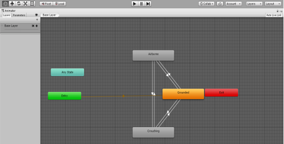<o:p>&nbsp;</o:p>

<o:p>&nbsp;</o:p>

<o:p>&nbsp;</o:p>

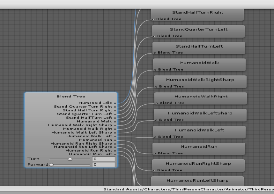<o:p>&nbsp;</o:p>

<o:p>&nbsp;</o:p>
<h2><b>３.３基于组件（Component）设计模式</b><b><o:p></o:p></b></h2>
秉承&#8220;组合优于继承&#8221;的设计原则，将各状态例如声音，物理，碰撞，脚本，相机等作为组件挂载在游戏对象上。可以通过组合实现各种复杂的功能，同时实现代码的复用。<o:p></o:p>

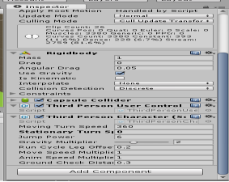<o:p>&nbsp;</o:p>
<h2><b>３.４游戏规则具体设计</b><b><o:p></o:p></b></h2>
游戏具有一下两个重要的规则：<o:p></o:p>

１.要在合适的背景音乐中，做合适的事情（在动音乐下，人物必须运动；在停音乐下，人物必须停止）；<o:p></o:p>

２.游戏开时会随机生成星星，且在最后十秒会随机生成生存圈，最后时间结束时吃到星星在生存圈中才能在时间结束后生存。<o:p></o:p>

音乐监听过程流程图设计如下<o:p></o:p>

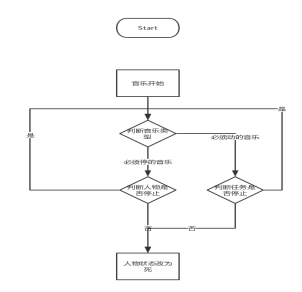<o:p>&nbsp;</o:p>

人物吃星星流程图如下<o:p></o:p>

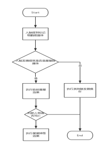<b><o:p>&nbsp;</o:p></b>

人物进圈流程图如下<o:p></o:p>

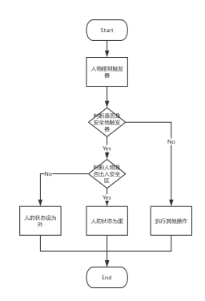<b><o:p>&nbsp;</o:p></b>

游戏胜利判定流程图<o:p></o:p>

<o:p>&nbsp;</o:p>

<b>第三人称用户控制器调用动画类进而修改状态机的时序图</b><b><o:p></o:p></b>

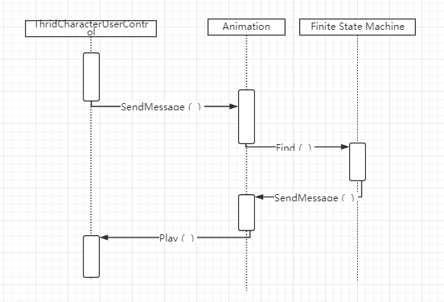<o:p>&nbsp;</o:p>

<b>时间触发器的时序图</b><b><o:p></o:p></b>

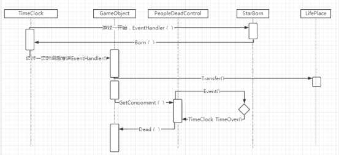<o:p>&nbsp;</o:p>

 <o:p></o:p>

<b>音乐触发器时序图</b><b><o:p></o:p></b>

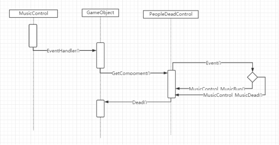<o:p>&nbsp;</o:p>

<o:p>&nbsp;</o:p>

 <o:p></o:p>
<h1 align=center  style="text-align:center;" ><b>游戏演示</b><b><o:p></o:p></b></h1>
<!--EndFragment--></body></html>
链接：http://pan.baidu.com/s/1gf9vBwf 密码：sag5

